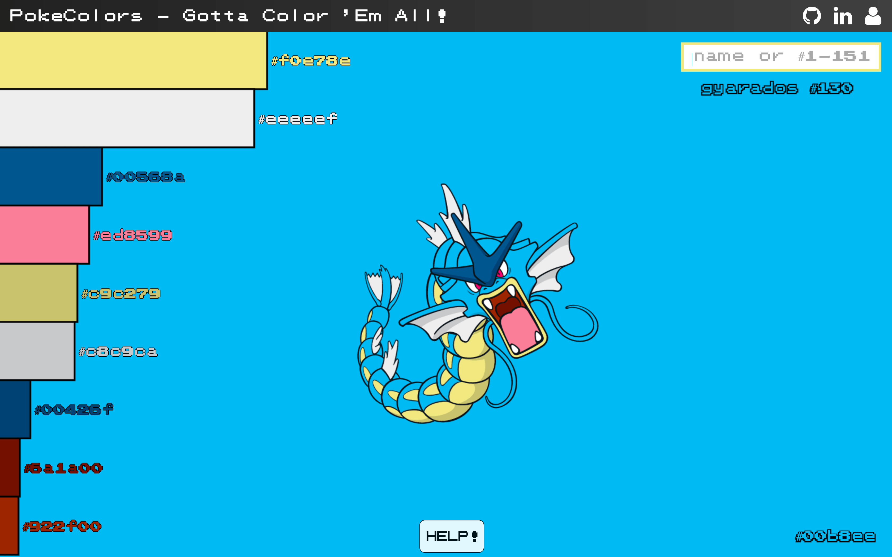

# PokeColors

Live: [PokeColors](www.raymondlee.io/PokeColors)



PokeColors is built on HTML Canvas using JavaScript and jQuery. It provides users with hex-codes of 151
original Pokemon. Perfect for designing and being creative with color choices.

SVG are hosted on CDN to avoid Cross-Origin Resource Sharing (CORS) tainting the canvas.

```JavaScript
this.img = new Image();
this.img.crossOrigin = 'anonymous';
this.img.src = POKEMON_LINKS[this.currentPokemon];
```

Each Pokemon image were analyzed using Canvas' getImageData method and saved as json to save rendering time.
The colors were changed to hex-codes, counted, and sorted by 10 most prominent colors.

```JavaScript
getImageData() {
  let imgData = this.ctx.getImageData(
    this.canvas.width / 2, this.canvas.height / 3,
    this.img.width, this.img.height
  ).data;

  for (var i = 0; i < imgData.length - 3; i+=4) {
    let r = imgData[i];
    let g = imgData[i + 1];
    let b = imgData[i + 2];

    let imgColor = this.colorHash({
      red: r,
      green: g,
      blue: b
    });

    if (imgColor in this.colors) {
      this.colors[imgColor] += 1;
    } else {
      this.colors[imgColor] = 1;
    }
  }
}
```

To access the local json object, python http-server was used to host and grab data.

```JavaScript
grabData() {
  $.getJSON('./lib/pokemon_data.json', function(data) {
    this.pokemonData = data;
    this.loadPokemon();
  });
}
```

But most importantly, it's fun!

I mean, who doesn't like Pokemon?
